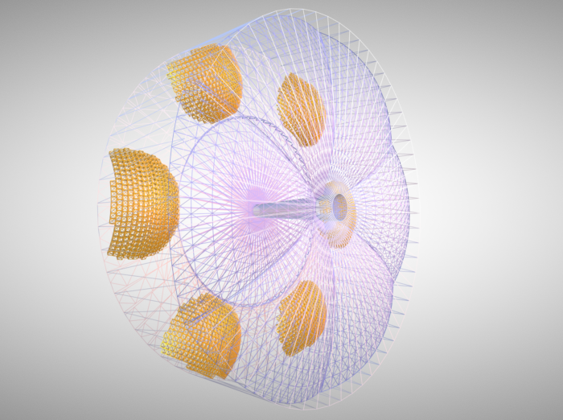

# root2cad
CERN ROOT geometry converter to CAD format (GLTF)



## TODO

- switch JSROOT from git submodule to npm dependency (possible after the next JSroot tag)
- make it an npm package with a binary (so `npm install -g root2cad` would bring a converter)


## Installation

**Prerequesties**

- One needs nodejs and npm installed ([Installation instruction](https://docs.npmjs.com/downloading-and-installing-node-js-and-npm#using-a-node-version-manager-to-install-nodejs-and-npm)). 
- xvfb (X virtual framebuffer)
    ```bash 
       sudo apt-get install xvfb    # on ubuntu
    ```

**Github clone**
```bash

git clone --recurse-submodules https://github.com/eic/root2cad.git
cd root2cad
npm install
xvfb-run node export.mjs --help    # should work
```

According to this
https://github.com/root-project/jsroot/issues/212

one needs to run through xvfb

```
apt-get install xvfb
xvfb-run node index.js
```

One can also use network locations as file names, like: 

```bash

xvfb-run node export.mjs "https://eicweb.phy.anl.gov/EIC/detectors/athena/-/jobs/559705/artifacts/raw/geo/calorimeters_geo.root?inline=false" default
```


**GDML conversion**

To convert GDML one can convert it to ROOT with this one liner:

```bash
root -e 'TGeoManager::Import("drich.gdml")->Export("drich.root")'
xvfb-run node export.mjs drich.root default -o drich.gltf
```

During this conversion, the saved object is named **'default'**
thus we use it to convert the resulting root geometry


